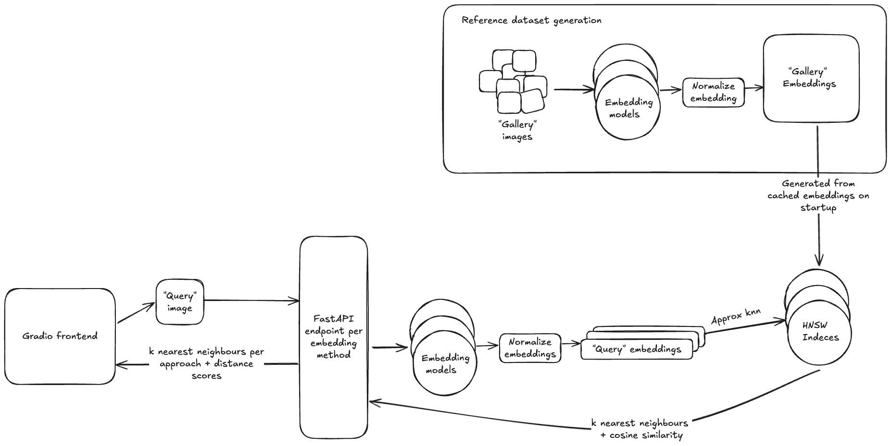
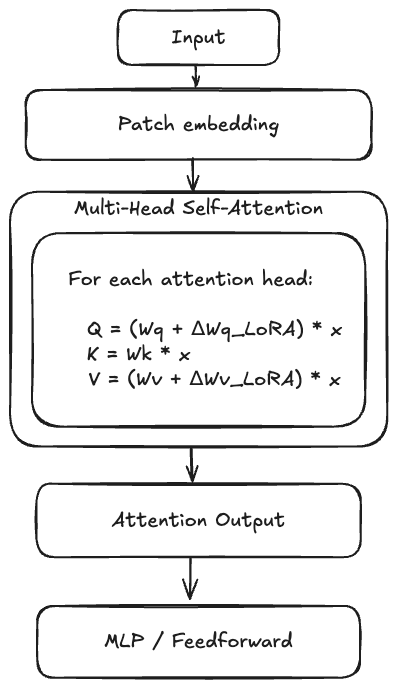

# SimSearch: LoRA Approach for Efficient Model Fine-Tuning

## Dataset

[The In-shop Clothes Retrieval Benchmark](http://mmlab.ie.cuhk.edu.hk/projects/DeepFashion/InShopRetrieval.html) is a subset of the [DeepFashion dataset](http://mmlab.ie.cuhk.edu.hk/projects/DeepFashion.html), designed to evaluate algorithms for large-scale fashion recognition and retrieval. The benchmark focuses on the challenging problem of identifying and retrieving images of clothing items from a gallery, given a query image. This task simulates real-world scenarios such as online shopping, where users may wish to find visually similar or identical items across different images, poses, and scales.

Key aspects of the benchmark include:
- **Cross-pose and cross-scale retrieval:** Images of the same clothing item are captured under varying poses, scales, and lighting conditions, testing the robustness of retrieval algorithms.
- **Rich annotations:** The dataset provides bounding boxes, fashion landmarks, item and attribute labels, segmentation masks, and dense pose annotations, enabling both supervised and unsupervised learning approaches.
- **Evaluation protocol:** The benchmark defines partitions for training, query, and gallery sets.

The goal is to advance research in computer vision for fashion, enabling more accurate and robust systems for clothes recognition, retrieval, and recommendation in practical applications.

## Vector Search Lookup

This project uses CLIP embeddings and FAISS for fast image similarity search. Gallery image embeddings are precomputed and stored in a CSV file. At runtime, these embeddings are loaded and indexed using FAISS’s HNSW (Hierarchical Navigable Small World Graph) algorithm for efficient nearest neighbor search.

**How the lookup works:**

1. The query image is encoded into a CLIP embedding.
2. The embedding is normalized to a unit vector (for cosine similarity).
3. FAISS searches for the top-k most similar gallery images using cosine similarity.

### About HNSW

HNSW (Hierarchical Navigable Small World Graph) is a graph-based algorithm for approximate nearest neighbor search. It builds a multi-layered graph structure that allows fast and scalable search in high-dimensional spaces. HNSW is widely used for large-scale similarity search because it offers:

- **High recall and speed:** Finds nearest neighbors quickly with high accuracy.
- **Scalability:** Handles millions of vectors efficiently.
- **Cosine similarity support:** HNSW efficiently searches in spaces where vectors are normalized (unit length). In this project, CLIP embeddings are explicitly normalized in code before indexing and search, ensuring that cosine similarity is meaningful and robust for image retrieval.

**Why cosine similarity for CLIP embeddings?**

CLIP is trained with a contrastive loss that encourages similar images and texts to have embeddings pointing in similar directions, regardless of their magnitude. Cosine similarity measures the angle between vectors, making it robust to differences in scale and focusing on semantic similarity. Since CLIP embeddings often have varying norms, L2 distance can be dominated by magnitude rather than direction, which is less meaningful for semantic comparison. Cosine similarity is also less sensitive to outliers and works well for high-dimensional, dense representations like those produced by CLIP.

In this project, FAISS’s HNSW implementation is used to index and search CLIP embeddings for image similarity tasks.

## Evaluation Metrics for Similarity Search

To assess the performance of image retrieval, we use several standard metrics:

- **Recall@k:** Measures the fraction of queries for which at least one correct item is retrieved in the top-k results. High recall@k indicates that relevant items are frequently found among the top candidates.
- **Precision@k:** Measures the fraction of top-k retrieved items that are relevant. For this benchmark, relevance is binary (correct item ID or not).
- **Mean Average Precision (MAP):** Computes the average precision across all queries, considering the rank of each relevant item. MAP is robust to class imbalance and rewards methods that rank correct items higher.
- **Mean Reciprocal Rank (MRR):** Measures the average reciprocal rank of the first relevant item for each query. High MRR means correct items tend to appear near the top of the results.

These metrics are well-suited for the In-shop Clothes Retrieval Benchmark, where each query has a single correct gallery item (binary relevance).

### About NDCG

**Normalized Discounted Cumulative Gain (NDCG)** is a popular metric for ranking tasks, especially when relevance is graded (e.g., 0, 1, 2, ...). In this benchmark, relevance is binary (0 or 1), so NDCG reduces to a form similar to MAP and MRR. While NDCG can still be computed, it does not provide additional insight beyond the chosen metrics when only binary relevance is available. If future tasks involve graded relevance (e.g., partial matches or attribute similarity), NDCG would become more valuable.

For most retrieval tasks in this project, recall@k, precision@k, MAP, and MRR are sufficient and interpretable.

## What is LoRA?

**LoRA (Low-Rank Adaptation)** is a technique for efficiently fine-tuning large neural networks. Instead of updating all weights, LoRA injects trainable low-rank matrices into specific layers (usually attention or linear layers), drastically reducing the number of parameters to train.

## Why Use LoRA?
- **Parameter Efficiency:** Only a small number of parameters are updated.
- **Faster Training:** Less memory and compute required.
- **Plug-and-Play:** Can be applied to pre-trained models without modifying their architecture.

## How LoRA Works

Instead of updating the full weight matrix $W$ in a neural network layer, LoRA decomposes the update into two smaller matrices $A$ and $B$:

$$
W' = W + BA
$$

Where:
- $W$ is the original weight matrix (frozen)
- $A$ and $B$ are low-rank matrices (trainable)

## Usage in This Project

This repository uses LoRA to fine-tune the Vision Transformer (ViT) part of CLIP for efficient similarity search in fashion images. Specifically, LoRA adapters are injected into the attention layers (`q_proj`, `v_proj`) of the ViT encoder, while the rest of the model remains frozen.

### How LoRA is used in CLIP's ViT Encoder

Below is a visual diagram showing LoRA applied to the attention blocks of the ViT encoder:  

Only the LoRA adapters are updated during training; the rest of the ViT and CLIP model weights are kept frozen.

See `scripts/train_clip_lora_lightning.py` for implementation details.

## References
- [LoRA: Low-Rank Adaptation of Large Language Models (arXiv)](https://arxiv.org/abs/2106.09685)
- [An Image is Worth 16x16 Words: Transformers for Image Recognition at Scale (arXiv)](https://arxiv.org/abs/2010.11929)
- [Attention Is All You Need](https://arxiv.org/abs/1706.03762)